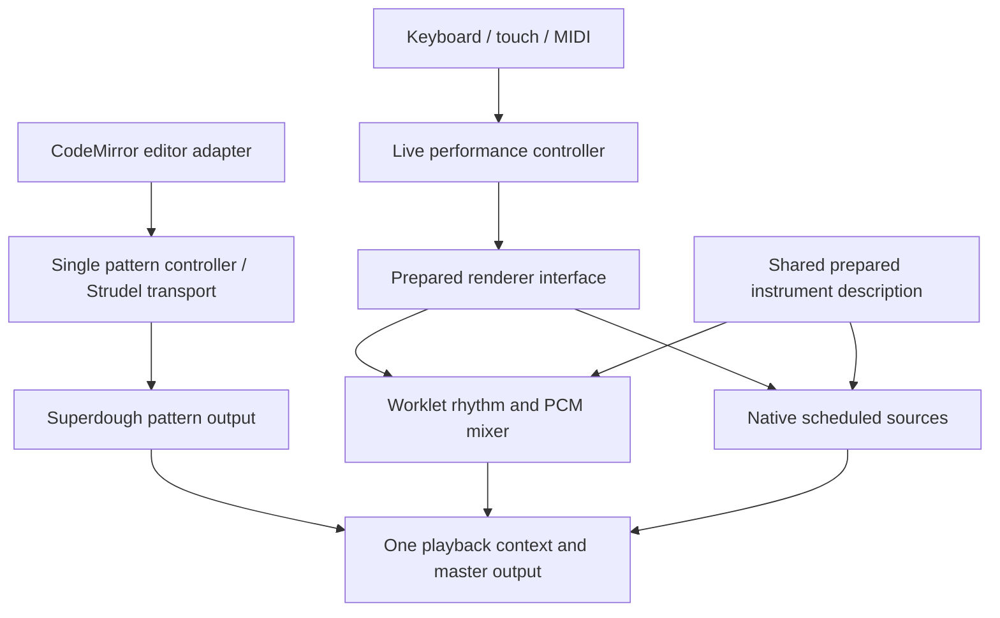

# Playback architecture and implementation plan

The recommendation is to share audio ownership and instrument preparation, keep pattern sequencing separate from live input, and make the live renderer replaceable. Keep the improved worklet as the default until a matched native Web Audio comparison supports changing it. Removing Superdough entirely is not justified: it still renders Strudel patterns and unsupported live instruments.

## Responsibilities

- `audioRuntime` owns the canonical playback context, master output and initialization. Remove the unused umbrella `@strudel/web` bootstrap and its hidden REPL/context. Temporary recording analysis and style-guide contexts are separate features, outside this playback invariant.
- `patternPlayback` owns the single StrudelMirror/REPL lifecycle. CodeMirror supplies editing and highlighting; Strudel supplies pattern evaluation and scheduling; Superdough produces the configured sound. Preserve guarded evaluation, tempo, live edits and stop behavior.
- `livePerformance` owns prepared live input, event plans and owner lifetimes. The music store supplies musical metadata and consumes recording, MIDI and visual events. Unsupported sounds retain the existing fallback.
- `liveRenderer` defines synchronous press/release/configure controls and timestamped lifecycle callbacks. Preparation happens before input is enabled, never inside a note press.
- Shared instrument descriptions resolve tuning, zone selection, loops, articulation and original decoded AudioBuffers. Native sources borrow those buffers; the worklet builder supplies channel views and its resampling pyramid, cloned into the audio thread.
- `livePlayback` selects the adapter, deduplicates preparation and bounds bank retention (four banks / 192 MiB). Held banks are pinned; retirement remains charged until acknowledged. Diagnostics distinguish retained PCM from additional renderer PCM.

## Swarm and migration

1. Runtime worker: canonical audio owner, modular Strudel imports, one pattern controller and editor integration; regressions for duplicate initialization and transport lifecycle.
2. Native worker: synchronous prepared AudioBufferSource/Oscillator renderer using original buffers, shared preparation and matched articulation/cancellation. Use a 400 ms future-event horizon and zero initial scheduling lead. Keep the existing fallback scheduler default unchanged.
3. Integration owner: renderer contract, backend manager and live-performance controller; preserve recording/MIDI timestamps through suspend, errors and disposal.
4. Browser worker: matched actual-app measurements for both adapters, trusted keyboard/touch input, real pattern editing/play/stop, common master, memory, stereo, rhythmic continuity and dense output.
5. Review, focused regressions, production build and full-suite comparison against known baseline failures; publish a focused PR stacked on the existing worklet PR.

## Acceptance and decision gate

Both adapters must produce sound for every trusted-input trial, preserve note ownership and stop/cancel behavior, use the same canonical playback output, and preserve sample semantics. Test real patterns through CodeStrip, including edits while playing. Count playback AudioContexts after both live and pattern initialization.

Compare onset at idle and with injected 25 ms UI haptic work. This measures browser input-to-render behavior, not finger-to-speaker latency. Physical device/ROLI evaluation remains a separate issue.

Run sixteenth-note rhythm through 300 ms and 650 ms main-thread stalls. Native scheduled sources continue only through their prepared horizon; a stall longer than 400 ms is an explicit limitation, not a reason to misreport the comparison. The worklet generates future rhythm in the audio thread and should continue through both. Initial DOM input still depends on the main thread for either adapter.

Keep the same 64 active voice limit (plus bounded fade tails) for the matched comparison. Report dense render headroom and stereo output. A source-count change is not an onset-latency improvement by itself.

Report native retained original PCM separately from worklet additional cloned PCM. Forgetting a native bank releases renderer references, not the shared Superdough sample cache. Do not claim a heap measurement from this accounting.

The default decision weighs responsiveness, rhythmic continuity, fidelity, memory and maintenance. Native can remove the extra PCM copy and custom resampling for direct playing, but its rhythm depends on timely replenishment. Worklet can preserve rhythm across long UI stalls but carries memory and DSP maintenance costs. Record matched evidence before changing the default.

## Patch retirement

The Superdough patch remains required by the legacy held-voice fallback. The soundfonts patch exposes cached decoded zones used by both prepared adapters. Remove a patch only after all callers migrate or an upstream version provides the same contract, with catalog and cancellation regression checks. Removing the hidden umbrella bootstrap is independent of removing these patches.

## Results

Implementation and matched comparison results will be recorded here before the PR is opened.
