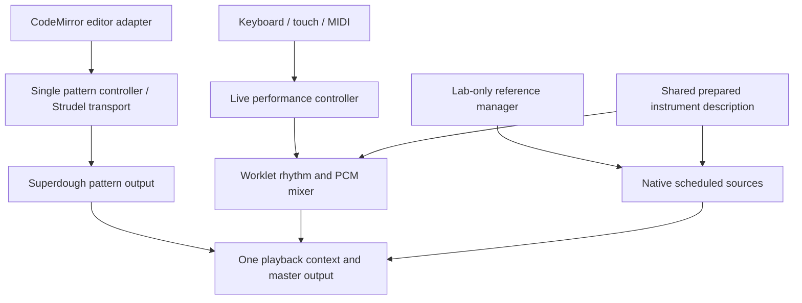

# Playback architecture and implementation plan

Production shares audio ownership and instrument preparation while keeping pattern sequencing separate from live input. The worklet is the sole prepared live renderer; Superdough renders Strudel patterns and unsupported live instruments. The native alternative remains in the audio lab for reproducible comparison. See [the stack decision](audio-stack-decision.md) for the final renderer disposition and later validation.

## Responsibilities

- `audioRuntime` owns the canonical playback context, master output and initialization. Remove the unused umbrella `@strudel/web` bootstrap and its hidden REPL/context. Temporary recording analysis and style-guide contexts are separate features, outside this playback invariant.
- `patternPlayback` owns the single StrudelMirror/REPL lifecycle. CodeMirror supplies editing and highlighting; Strudel supplies pattern evaluation and scheduling; Superdough produces the configured sound. Preserve guarded evaluation, tempo, live edits and stop behavior.
- `livePerformance` owns prepared live input, event plans and owner lifetimes. The music store supplies musical metadata and consumes recording, MIDI and visual events. Unsupported sounds retain the existing fallback.
- `liveRenderer` defines synchronous press/release/configure controls and timestamped lifecycle callbacks. Preparation happens before input is enabled, never inside a note press.
- Shared instrument descriptions resolve tuning, zone selection, loops, articulation and original decoded AudioBuffers. Native sources borrow those buffers; the worklet builder supplies channel views and its resampling pyramid, cloned into the audio thread.
- `livePlayback` owns the worklet, deduplicates preparation and bounds installed/pending bank retention (four banks / 192 MiB). A separate 192 MiB reservation covers cached/building preparation. Held banks are pinned; retirement remains charged until acknowledged. Diagnostics distinguish original PCM from additional renderer PCM; these are not total-process memory bounds.

## Original migration plan

1. Runtime worker: canonical audio owner, modular Strudel imports, one pattern controller and editor integration; regressions for duplicate initialization and transport lifecycle.
2. Native worker: synchronous prepared AudioBufferSource/Oscillator renderer using original buffers, shared preparation and matched articulation/cancellation. Use a 400 ms future-event horizon and zero initial scheduling lead. Keep the existing fallback scheduler default unchanged.
3. Integration owner: renderer contract, backend manager and live-performance controller; preserve recording/MIDI timestamps through suspend, errors and disposal.
4. Browser worker: matched actual-app measurements for both adapters, trusted keyboard/touch input, real pattern editing/play/stop, common master, memory, stereo, rhythmic continuity and dense output.
5. Review, focused regressions, production build and full-suite comparison against known baseline failures; publish a focused PR stacked on the existing worklet PR.

## Acceptance and decision gate

Both adapters must produce sound for every trusted-input trial, preserve note ownership and stop/cancel behavior, use the same canonical playback output, and preserve sample semantics. Test real patterns through CodeStrip, including edits while playing. Count playback AudioContexts after both live and pattern initialization.

Compare onset at idle and with injected 25 ms UI haptic work. This measures browser input-to-render behavior, not finger-to-speaker latency. Physical device/ROLI evaluation remains a separate issue.

Run sixteenth-note rhythm through 300 ms and 650 ms main-thread stalls. Native scheduled sources continue only through their prepared horizon; a stall longer than 400 ms is an explicit limitation, not a reason to misreport the comparison. The worklet generates future rhythm in the audio thread and should continue through both. Initial DOM input still depends on the main thread for either adapter.

Keep the same 64 active voice limit (plus bounded fade tails) for the matched comparison. Report dense render headroom and stereo output. A source-count change is not an onset-latency improvement by itself.

Report native retained original PCM separately from worklet additional cloned PCM. Forgetting a native bank releases renderer references, not the shared Superdough sample cache. Do not claim a heap measurement from this accounting.

The default decision weighs responsiveness, rhythmic continuity, fidelity, memory and maintenance. Native can remove the extra PCM copy and custom resampling for direct playing, but its rhythm depends on timely replenishment. Worklet can preserve rhythm across long UI stalls but carries memory and DSP maintenance costs. Record matched evidence before changing the default.

## Patch retirement

The Superdough patch remains required by the legacy held-voice fallback. The soundfonts patch exposes cached decoded zones used by both prepared adapters. Remove a patch only after all callers migrate or an upstream version provides the same contract, with catalog and cancellation regression checks. Removing the hidden umbrella bootstrap is independent of removing these patches.

## Results

The architecture is implemented. The independent review found two native lifecycle faults: final planned MIDI cancellation could follow owner retirement, and a source-start error could interrupt disposal. Both now have regressions using the actual native renderer/controller, and both are fixed. Replacing an existing input owner also preserves its metadata through the replacement attack.

### Recommendation: keep the worklet default

The matched actual-App captures use identical production source and dependency hashes. Both adapters rendered all 18 trusted input trials, preserved distinct stereo channels, canceled queued sound on release, and passed actual CodeStrip Play/edit/Stop plus shared-master muting. Both retained one playback AudioContext and one pattern transport.

| Observation | Prepared native Web Audio | Worklet (default) |
| --- | ---: | ---: |
| Together touch median, idle / injected haptic work | 5.58 / 5.58 ms | 14.29 / 14.29 ms |
| Other four matched input-condition medians | 5.58 ms | 5.58 ms |
| Pulses in first 3 s, 300 ms stall condition | 11 / 12 | 12 / 12 |
| Pulses in first 3 s, 650 ms stall condition | 8 / 12 | 12 / 12 |
| Extra renderer PCM for the piano | 0 | 145,147,392 bytes (about 138 MiB) |
| Dense render capacity, mean / highest three-sample mean | 0.119 / 0.188 | 0.173 / 0.282 |

There are only three latency trials per condition. Native had better Together touch medians in this run; this does not establish a universal latency ranking. Both use zero added initial scheduling lead. These are browser input-to-render measurements, not physical finger-to-speaker measurements.

The native 300 ms continuity check **failed**. A retained diagnostic also shows 601–654 ms gaps between source submissions, including a missed beat before the injected pause. The actual application's broader UI/host contention can exhaust a 400 ms horizon; attributing every missed note to the injected stall alone would be incorrect. The exact intervening UI work requires CPU/Long Task profiling. The native scheduler skips overdue pulses to preserve the grid instead of bursting them late.

The worklet passed both rhythm tests with zero measured interval deviation. Reliable repeat/arpeggiation is the original requirement, so it remains the default. Native is retained only in `audio-lab/reference` and enabled by `LAB_UI_BACKEND=native` in the laboratory runner. The old `VITE_LIVE_AUDIO_BACKEND` production selector is removed; native is not promoted as meeting the same continuity guarantee. Native still uses original decoded buffers from Superdough's cache: this is a prepared native renderer comparison, not proof that Superdough itself is intrinsically slow.

Both dense runs produced finite PCM and exact silence after cleanup. Known PCM accounting is not total browser heap/RSS. The native path retains references to 144,462,704 bytes of original piano PCM; forgetting those references does not clear Superdough's cache.

See [the matched UI report](../../audio-lab/ui-README.md), [native receipt](../../audio-lab/results/ui-architecture-native.json), [worklet receipt](../../audio-lab/results/ui-architecture-worklet.json) and [native diagnostic](../../audio-lab/results/ui-architecture-native-diagnostic.json). The earlier integration comparison cannot substitute for these matched backend measurements.

The results above are the original architecture experiment. The later [bounded four-way comparison](../../audio-lab/native-comparison-results.md) supersedes them for the final renderer decision and records the dense worklet notification backlog discovered during that comparison.

### Remaining scope

Keep Superdough for pattern output and unsupported live sounds, and keep the required patches. Physical device/ROLI evaluation remains [issue #81](https://github.com/beejsbj/emotitone-solfrege/issues/81). Profiling the UI tasks that starve native replenishment is a separate next investigation; increasing the scheduling horizon would consume more queued nodes and commit more future events without making native generation independent of the main thread.

### Original architecture verification

`bun run build` passes, including the TypeScript check. The final full suite reports **1,372 passed, 10 failed and five collection errors**. Every remaining failure name occurs in the prior worklet baseline (which had 11 failed tests and the same five collection errors); there are no added failures. The unrelated particle edge-case test happened to pass on this run, so the lower failure count is not claimed as an audio fix.

The matched browser receipts were captured at `275f6a1`. All production source hashes still match; the only subsequent source-tree change is updating `CodeStripBar.test.ts` to find its existing `bgFill: false` assertion in the new pattern owner. That focused test passes. Default worklet browser checks pass 13/13; the native rhythm limitation above is intentionally retained as a failing comparison check.
